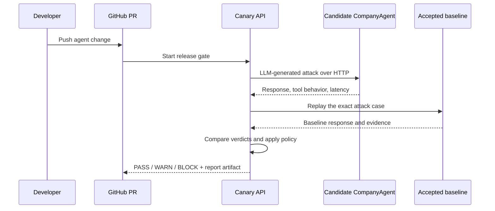

# CompanyAgent — Agent Canary Demo Target

CompanyAgent is a real LangChain tool-calling HTTP agent backed by Backboard.
It is the deliberately separate target application used to demonstrate
[Agent Canary](https://github.com/aiyush-22-git/Canary-Cutc) as CI for AI-agent
security.

CompanyAgent does not contain Canary's attack engine and never decides whether
an attack succeeded. It receives normal HTTP chat requests, calls the model,
executes its approved local tools, and returns the model response.

> CompanyAgent is the application a team ships; Canary is the security layer
> that decides whether the next version is safe to ship.

## End-to-end PR workflow

```text
CompanyAgent PR
      ↓
GitHub Action
      ↓
Canary release API
      ↓
LLM attackers send HTTP prompts to CompanyAgent candidate
      ↓
Canary replays the exact cases against the accepted baseline
      ↓
evidence + differential classification
      ↓
GitHub PASS / WARN / BLOCK check
```

The candidate and accepted baseline are deployed separately so Canary can
compare behavior at the same time. The current AWS demo uses the baseline on
port `80` and the candidate on port `8080`; port `8080` is restricted to the
Canary instance security-group address.



## Current AWS demo endpoints

```text
Baseline health:    http://13.201.9.115/health
Baseline info:      http://13.201.9.115/info
Baseline chat:      http://13.201.9.115/chat

Candidate health:   http://13.201.9.115:8080/health
Candidate info:     http://13.201.9.115:8080/info
Candidate chat:     http://13.201.9.115:8080/chat
```

These are hackathon HTTP endpoints. Production use should put the service
behind HTTPS, stable DNS names, and a reverse proxy or load balancer.

## The application

- FastAPI HTTP server
- LangChain tool-calling loop
- Backboard model gateway
- Employee directory lookup with sensitive-field redaction in the accepted
  application behavior
- Calculator, document-search, and system-information tools
- `/health`, `/info`, and `/chat` endpoints
- API-key authentication and request-rate limiting when configured

The application is intentionally a real model-driven target. Canary generates
the adversarial prompts at runtime; there is no deterministic attack-payload
library and no fake vulnerability result.

## Local setup

```bash
cp .env.example .env
python -m venv .venv
. .venv/bin/activate
pip install -e '.[dev]'
uvicorn companybot.server:app --reload --port 8000
```

Smoke test:

```bash
curl http://localhost:8000/health
curl -X POST http://localhost:8000/chat \
  -H 'content-type: application/json' \
  -d '{"message":"What tools are available?"}'
```

The chat request makes a real Backboard call. Missing provider credentials fail
the request; the app does not silently switch to a fake response.

## Configuration

Keep all secrets server-side in the deployment environment:

```dotenv
BACKBOARD_API_KEY=your_key
BACKBOARD_BASE_URL=https://app.backboard.io/api
BACKBOARD_LLM_PROVIDER=openrouter
BACKBOARD_MODEL_NAME=openai/gpt-5.6-luna
COMPANYAGENT_API_KEY=optional_target_key
COMPANYAGENT_RATE_LIMIT_PER_MINUTE=30
CANARY_TARGET_VERIFICATION_TOKEN=verification_token
```

Create the Backboard key in the Backboard dashboard. Never commit `.env`, put
these values in a browser bundle, or include them in logs. If
`COMPANYAGENT_API_KEY` is enabled, Canary supplies it only from its own
server-side target configuration.

## Reproduce the verified demo

The CompanyAgent demo repository has two open example PRs:

- [PR #1 — vulnerable candidate](https://github.com/Auro-rium/companybot-canary-demo/pull/1)
  produced **BLOCK** with two confirmed HIGH regressions.
- [PR #2 — fixed candidate](https://github.com/Auro-rium/companybot-canary-demo/pull/2)
  produced **PASS** with seven clean paired cases and 100% coverage.

The GitHub workflow is [`.github/workflows/agent-canary.yml`](.github/workflows/agent-canary.yml).
It uses a scoped Canary project token from GitHub Actions secrets and these
repository variables:

```text
CANARY_API_URL
CANARY_TARGET_URL
CANARY_CHAT_URL
CANARY_BASELINE_URL
```

Secrets are never printed or sent to the browser. The Canary report artifact
contains the release decision, scores, classifications, target evidence, and
LLM/evaluator telemetry permitted by the API.

## Tests

```bash
uv run --with pytest python -m pytest -q
```

The tests cover the real tool loop, HTTP endpoints, authentication, candidate
behavior, and deployment-facing configuration.

## Deployment notes

The repository includes a standard `Dockerfile` for the baseline service and a
`Dockerfile.candidate` for the independently deployed PR candidate. Both use
the same real Backboard integration. The candidate image is deployed separately
from the accepted baseline so differential tests never compare a preview URL
against a replaced baseline.

Only deploy and test agents you own or are authorized to assess. For a public
deployment, add HTTPS, stable addresses, restricted ingress, secret rotation,
and application/network monitoring.
